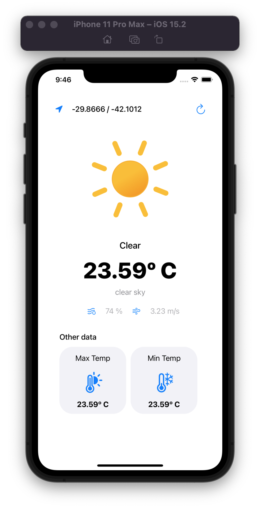

# Weather App

### Used tools:
- Xcode 13.2.1
    - SPM:
        - Alamorfire
        - Lottie
- Openweathermap (API)
- Dribbble desing: https://dribbble.com/shots/14784828-Weather-forecast-interface
- Lottiefiles

### Description
This application consists of displaying the meteorological weather of random coordinates to the user.
For this purpose, an MVVM architecture has been proposed for this app together with a separate service to make the tests easier.

With the help of the Alamorfire framework, a request is made to the Open weather map api. Receiving this data to the view model and processing it to send it to the view controller where all the information is displayed.

Not all the information received by the api has been included, the most relevant has been used.

It is possible to obtain the atmospheric weather of another place by clicking on the refresh button.

Lottie has been used for the animations.
System icons have been used, so the minimum version for testing the app will be iOS 13.

Unit tests have been included.

Video of the application is attached.

### Video
[Link](https://github.com/xexuew/WeatherApp/blob/main/imgs/video.mp4)
